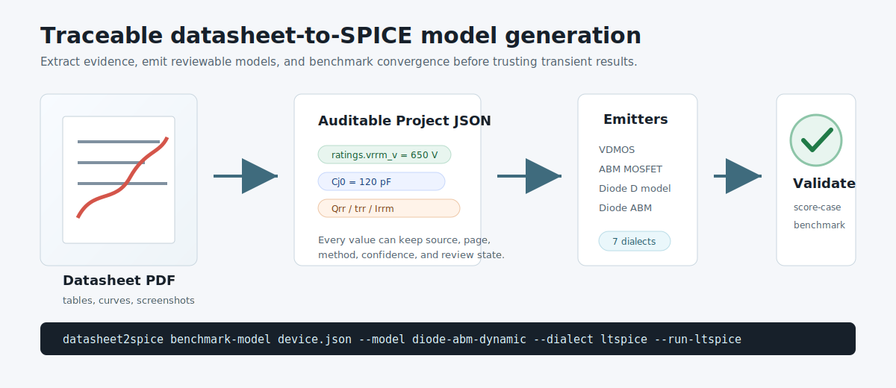

# datasheet2spice

[](https://github.com/lisiqi1983/datasheet2spice/actions/workflows/tests.yml)
[](https://github.com/lisiqi1983/datasheet2spice/actions/workflows/pages.yml)
[](LICENSE)

`datasheet2spice` turns reviewable datasheet evidence into starter SPICE models.
It is built for power electronics engineers who need transparent MOSFET and
diode models, not black-box netlists whose assumptions are impossible to audit.

The project combines PDF extraction, editable device JSON, model emitters,
SPICE dialect support, and validation benchmarks so every generated parameter
can be checked against a datasheet, vendor model, or lab waveform.

[Try the hosted workbench](https://lisiqi1983.github.io/datasheet2spice/workbench_app.html) |
[Read the docs](https://lisiqi1983.github.io/datasheet2spice/) |
[Model validation](https://lisiqi1983.github.io/datasheet2spice/model_validation.html) |
[Start contributing](CONTRIBUTING.md)



## Why It Exists

Power device models are often locked in vendor libraries, tied to one simulator,
or missing for a specific device revision. `datasheet2spice` takes a different
route:

- extract auditable values from datasheets,
- keep source evidence and confidence near every parameter,
- generate simple, reviewable model starters,
- support several SPICE dialects,
- benchmark convergence, speed, and accuracy before claiming model quality.

Generated models are starting points for simulation and lab fitting. They are
not vendor-qualified or safety-qualified models.

## Current Capabilities

- Component profiles for power MOSFET / SiC MOSFET and power diode / Schottky /
  SiC diode.
- Browser workbench for PDF text extraction, editable project JSON, diode
  series-part selection, and starter SPICE export.
- Local Python workbench with table recognition, screenshot evidence,
  vector/raster curve digitization, fitting, and model evaluation.
- Model emitters for `vdmos-static-fast`, `abm-basic`, `diode-basic`, and
  `diode-abm-dynamic`.
- Dialects: common SPICE, LTspice, ngspice, PSpice, HSPICE, Xyce, and
  experimental QSPICE.
- Validation commands for extraction golden cases and model benchmark evidence.
- Plugin interfaces for new extractors, fitters, emitters, validators, and UI
  tool panels.

## Validation Status

| Area | Current status |
| --- | --- |
| Demo diode extraction golden case | passing |
| All-dialect diode model generation | passing, 28 generated files |
| LTspice diode smoke convergence | passing, 2 decks, 0 warnings |
| Public datasheet regression manifest | initial ST, Diodes Inc, Toshiba, Wolfspeed candidates |
| Vendor-model waveform comparison | planned |
| ngspice/Xyce automated simulation benchmarks | planned |

See [Model Validation](docs/model_validation.md) and
[validation assets](validation/README.md) for the quality workflow.

## Quick Start

Python 3.10+ is required.

```powershell
python -m pip install -e .
```

Generate demo models:

```powershell
datasheet2spice emit examples/demo_sic_mosfet/device.json --out build/demo --all
datasheet2spice emit examples/demo_sic_diode/device.json --out build/demo_diode --model diode-abm-dynamic --dialect all
```

Run the local browser workbench:

```powershell
python -m pip install -e .[pdf]
datasheet2spice serve --host 127.0.0.1 --port 8765
```

Run quality gates:

```powershell
datasheet2spice score-case examples/demo_sic_diode/device.json validation/golden/demo_sic_diode.case.json
datasheet2spice benchmark-model examples/demo_sic_diode/device.json --out build/bench-diode --model diode-basic --model diode-abm-dynamic --dialect all
```

Run tests:

```powershell
python -m unittest discover -s tests -v
```

## Model Families

`VDMOS static-fast`

- Fast compact model baseline for early power-stage sweeps.
- Starter parameters include `Vto`, `Kp`, `Rd/Rs`, `Rg`, capacitances, and body
  diode terms.

`ABM dynamic-basic`

- Flexible behavioral MOSFET starter.
- Uses smooth channel current plus nonlinear capacitance tables.
- Supports the major built-in dialects.

`Diode basic`

- Portable two-terminal diode starter using native SPICE `D` model cards.
- Uses forward voltage, reference current, reverse rating, junction capacitance,
  leakage, recovery data, and package parasitics when available.

`Diode ABM dynamic`

- Portable behavioral diode starter for transient recovery studies.
- Adds nonlinear `Cj(VR)` current and a one-state reverse-recovery charge
  approximation around the same DC diode core.

## Good First Contributions

The easiest useful contribution is a small, public validation case:

- add a public datasheet manifest entry,
- add expected table values and tolerances,
- test one generated model in LTspice or ngspice,
- report an extraction failure with a screenshot and source URL,
- improve docs for a simulator or device family you use.

See the issue labels `good first issue` and `help wanted`, or open a Discussion
with the datasheet or model family you want to support.

## Documentation

- [Quick Start](docs/quickstart.md)
- [Architecture](docs/architecture.md)
- [Deployment Modes](docs/deployment_modes.md)
- [Interface Contracts](docs/interface_contracts.md)
- [Development Workflow](docs/development.md)
- [Schema](docs/schema.md)
- [Plugins](docs/plugins.md)
- [Web Workbench](docs/workbench.md)
- [Browser Workbench](docs/webapp.md)
- [Raster Plot Digitization](docs/raster_digitization.md)
- [SPICE Dialects](docs/spice_dialects.md)
- [Modeling Notes](docs/modeling.md)
- [Model Validation](docs/model_validation.md)
- [Limitations](docs/limitations.md)
- [License Strategy](docs/license_strategy.md)
- [Roadmap](docs/roadmap.md)

## License

The core package is Apache-2.0. Optional integrations may have stronger
licenses. See [THIRD_PARTY_LICENSES.md](THIRD_PARTY_LICENSES.md).

## Important Caveats

- Do not redistribute confidential datasheets without permission.
- Do not treat generated models as vendor-qualified or safety-qualified models.
- Always validate switching behavior against datasheet test conditions or
  measured double-pulse waveforms.
- High-order BSIM/HiSIM extraction generally requires process/device
  characterization data beyond ordinary datasheets.
