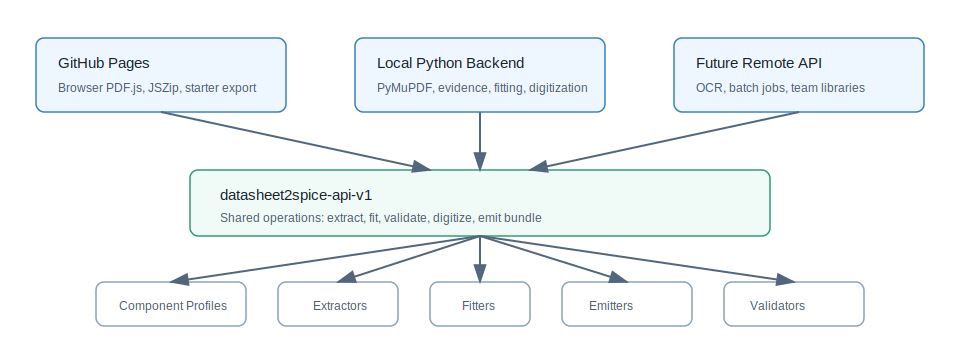

# Architecture

`datasheet2spice` is being shaped as a general datasheet-to-model toolkit. The
first production component family is power MOSFET / SiC MOSFET, but the
architecture is intentionally split so later component packs can add IGBTs,
BJTs, op amps, regulators, magnetics, and small engineering tools.

## Layering



```text
Web UI / CLI / future desktop shell
        |
        v
API contract and backend adapters
        |
        v
service layer
        |
        v
core schema, units, provenance, runtime capabilities
        |
        +--> component profiles
        +--> extractors
        +--> fitters
        +--> model emitters
        +--> validators
        +--> tool panels
```

The HTTP workbench is deliberately thin. It parses requests, stores uploads,
and calls `datasheet2spice.service`. This keeps extraction, fitting, model
generation, and reporting reusable from a local REST server, CLI commands,
tests, and future desktop or remote adapters.

## Runtime Modes

The frontend should target one stable contract and then select an adapter:

- `browser-pages`: static GitHub Pages, PDF.js, JavaScript, Web Workers, and
  future Rust/WASM helpers. This mode is no-install and should demonstrate the
  product well, but it avoids simulator execution and heavy server-side OCR.
- `local-python`: high-fidelity local backend with PyMuPDF extraction,
  screenshot evidence, table candidates, vector/raster curve digitization,
  fitting, quality scoring, and optional simulator smoke tests.
- `remote-api`: future hosted backend for AI/OCR, batch processing, and team
  model libraries. It is intentionally not required for the v1 workflow.

The runtime capability matrix lives in `datasheet2spice.runtime` so docs, APIs,
and UI labels can stay consistent.

## Data Model Direction

`DeviceProject` remains the backward-compatible Python class. `ComponentProject`
is an alias that signals the broader roadmap.

New projects include a `component` envelope:

```json
{
  "schema_version": "1.0",
  "component": {
    "family": "mosfet",
    "profile": "mosfet.power"
  },
  "device": {
    "part_number": "EXAMPLE",
    "type": "n_power_mosfet"
  }
}
```

The common envelope should hold identity, provenance, review state, and model
targets. Component profiles define the family-specific fields that are required
for extraction, fitting, and model emission.

## Plugin Boundaries

Built-in and third-party packages can extend these surfaces:

- component profiles,
- PDF/text/table/curve extractors,
- parameter fitters,
- model emitters,
- validators,
- UI tool panels.

The current built-in component profiles are `mosfet.power` and `diode.power`.
The current built-in emitters are `vdmos-static-fast`, `abm-basic`, and
`diode-basic`.

## Design Rules

- Keep the core schema and emitters dependency-light.
- Put optional PDF, OCR, simulator, and AI dependencies behind service or plugin
  boundaries.
- Every extracted value should be auditable through provenance and evidence.
- GitHub Pages should remain useful without installation, but the local backend
  is the authoritative path for high-fidelity extraction and verification.
- Generated models are starters, not vendor-qualified device models.
