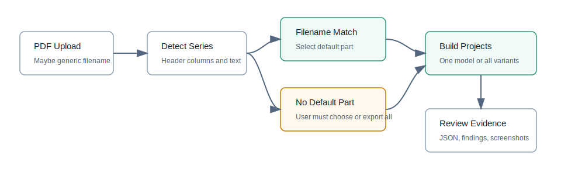

# Browser Workbench

The local browser workbench lets a user upload a MOSFET or diode datasheet PDF,
review automatically extracted parameters, choose model families, and generate
a ZIP model bundle.

The HTTP handler is intentionally thin. Extraction, fitting, model bundle
generation, and raster digitization are implemented in `datasheet2spice.service`
so the same backend logic can later be exposed through FastAPI, a desktop shell,
or tests without rewriting the workbench.

Start it from the repository:

```powershell
python -m pip install -e .[pdf]
datasheet2spice serve --host 127.0.0.1 --port 8765
```

Open:

```text
http://127.0.0.1:8765
```

The local server refuses non-local host bindings by default. If you deliberately
need LAN exposure for a trusted environment, set
`DATASHEET2SPICE_ALLOW_NETWORK_BIND=1` before using a non-local `--host`.
Browser POST requests are also limited to the same origin as the local server.

## Workflow



1. Upload a PDF datasheet.
2. Review the extracted fields, confidence scores, warnings, source snippets,
   rendered datasheet screenshots, recognized table candidates, and
   auto-digitized curve data.
   Click a parameter row to show its matching PDF crop; click the curve
   digitization table to compare the data against the source plot.
   If the upload is a multi-part diode series datasheet, choose the target part
   before generation. When the filename does not contain a detected part number,
   generation stays disabled until a part is selected.
3. Correct common parameters in the review form, or edit the project JSON
   directly for deeper changes.
4. Run parameter fitting and model quality evaluation.
5. Select `ABM Behavioral Model`, `VDMOS Compact Model`, `Diode Compact Model`,
   or `Diode Behavioral Model`, and the target SPICE dialect.
   The workbench can emit common SPICE, LTspice, ngspice, PSpice, HSPICE,
   Xyce, and experimental QSPICE bundles. See [SPICE Dialects](spice_dialects.md).
6. Generate and download the ZIP model bundle.

Generated files are written under `build/webapp/<session>/generated/`.
Extraction results are cached under `build/webapp/<session>/extract_result.json`;
open `http://127.0.0.1:8765/?session=<session>` to replay a previous review
state for visual regression or continued checking.

The local server also exposes `GET /api/capabilities`, which reports the active
runtime mode and the shared API contract used by the frontend/backend split.

## Extraction Scope

The v1.0 workbench uses PyMuPDF text extraction plus datasheet heuristics. It is
good enough to create a reviewable starter model from many tabular MOSFET and
diode datasheets, but it is not a full semantic datasheet parser.

The extractor currently targets common fields:

MOSFET:

- `VDSS`, continuous `ID`, `VGS_on`, `VGS_off`
- `VGS(th)`, `RDS(on)`, `gfs`, internal `RG`
- `Ciss`, `Coss`, `Crss`
- `Qg`, `Qgs`, `Qgd`
- body-diode `VSD`, `trr`, `Qrr`, `Irrm`

Diode:

- `VRRM`, `IF(AV)`, `IFSM`
- `VF`, leakage `IR`
- junction capacitance `Cj` or `Ct`
- reverse-recovery `trr`, `Qrr`, and `Irrm`
- package parasitic starter values for anode and cathode leads

Diode series datasheets are handled as a first-class extraction result. The
backend returns the selected `project`, a `series` summary, and
`variant_projects` for each detected part number. The UI can generate either
one selected model or a ZIP bundle containing all variants in separate folders.

If only one capacitance point is found, the workbench creates a conservative
starter `C(V)` curve so the built-in emitters can run. Replace it with a
digitized curve for serious transient fitting.

## Added Analysis Tools

- Table recognition groups PDF words into table candidates and shows the
  highest-scoring rows in the review pane, with side-by-side PDF image crops.
- Curve digitization detects vector `Ciss/Coss/Crss` log-log plots when the PDF
  preserves curves as vector paths.
- Raster plot digitization renders a calibrated PDF plot crop and traces a
  single scanned curve with axis/grid suppression, coverage metrics, and a
  reviewable point list. See [Raster Plot Digitization](raster_digitization.md).
- Parameter fitting computes VDMOS starter parameters, MOSFET ABM
  recommendations such as `KID`, `CGD_SCALE`, and `CGS_SCALE`, and diode ABM
  recovery parameters such as `TAU_ns` and `RR_SCALE`.
- Model evaluation scores static coverage, dynamic coverage, capacitance
  consistency, fit consistency, and schema validity. The score is a review aid,
  not a replacement for waveform validation.
